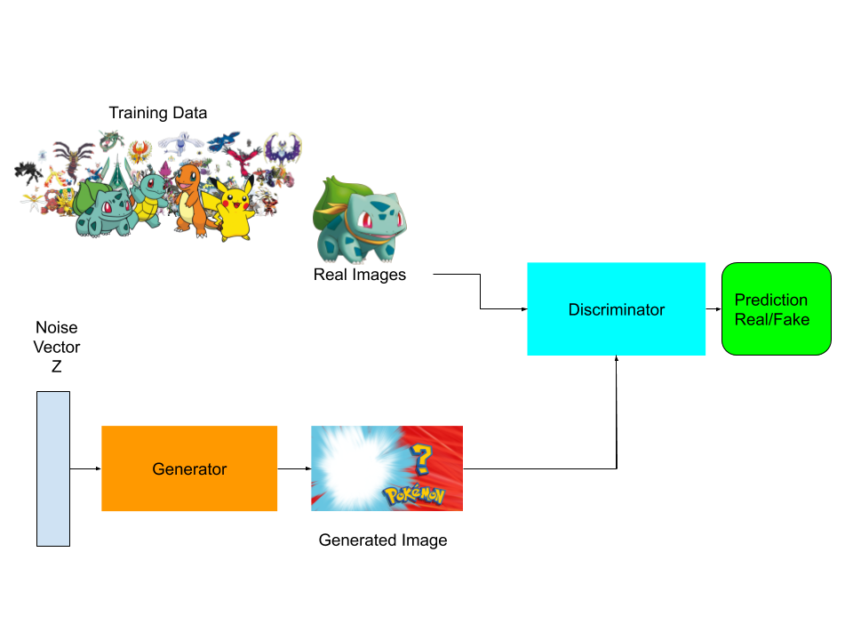

# CS235 Data Mining Project

The goal of this project is to correctly classify any particular pokemon’s type from the image of the pokemon or from other attributes of the pokemon using ConvNets and linear regression respectively.  There are a total of  eighteen different Pokémon types which include but are not limited to Poison, Ground, Rock, Bug, Ghost, Steel, and Fire to name a few. In addition, there are 8 attributes that all pokemon have for instance HP, Attack, and Defense. Furthermore, pokemon are not limited to one single type, some of them can have 2 types. This will make classifying both types more tricky since with only one type we would have 1/18 chance of getting it right if we guess, however with the addition of the second type we now have a 171 permutations or 1/171 chance about being correct just by guessing. However the real number of types is 136 since a lot of the possible combinations have not yet been used on any pokemon.  In order to achieve decent performance we will need our models to find high other representations in of the data. We do not expect to get high performance, since even human performance in this data would be far from perfect. Some instances like Charmander are pretty obvious to be fire type  simply from the color and the flame on its tail however, some might confuse it for a dragon type as well which is incorrect.  One of the methods that we will be using is a convolutional neural network since it is known to achieve good performance on image classification task. The other method that we will be using will be logistic regression to on attribute data. We hope the a linear combination of  the attributes will be have some hints of the types of the pokemon but think that is unrealistic considering that the pokemon attributes are balanced. 

The two data sets can be found here:

[6036 label pokemon pictures ](https://www.kaggle.com/hannesrosenbusch/6036-labeled-pokemon-pictures#poke_image_data.npy)

[Better data all 7 Generations of Pokemon](https://github.com/udacity/AIPND/blob/master/Matplotlib/data/pokemon.csv)

